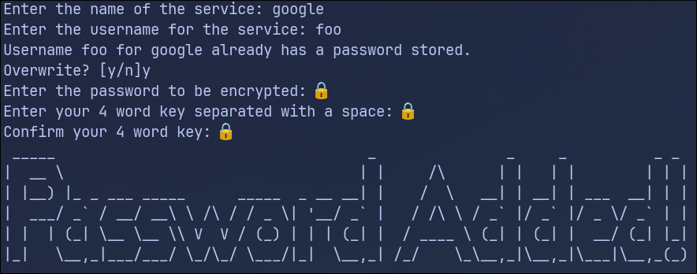
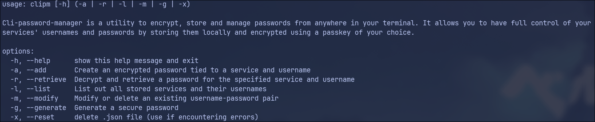
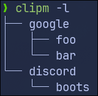

##  Honorable mention on the [Boot.dev](https://boot.dev/) 2025 Hackathon🔥
Contributors:
-ManoloEsS
-Soullessgent

This project is a prototype/proof of concept for educational purposes. Use at your own risk. Not recommended for use in production.


# 🔐 CLI Password Manager

Cli-password-manager is a utility to encrypt, store and manage passwords from anywhere in your terminal. It allows you to have full control of your
services' usernames and passwords by storing them locally and encrypted using a passkey of your choice.

## De-google-ify your life and take control of your data.

> "The closest thing to burying your passwords in an undisclosed location without having to go outside"  
> —Some arch user, probably

---

## 🚀 Features

- Store, retrieve, and manage passwords securely
- Easy-to-use CLI interface
- Encryption for stored passwords
- Generate secure passwords on demand
- Cross-platform support
- Open-source and customizable

---

## 🧑‍💻 How does it work?

 ### When you save a password it gets encrypted using the "Cryptography" library

- A four word passkey acts as the encryption and decryption key
- A secure 32-byte hash is derived from the passkey and used as the salt in the encryption and decryption process
- Fernet(symmetric encryption) is one of the most widely used for developers to secure sensitive information
- Data is stored locally in a .json file

### Why 4 words?

- Inspired by xkcd's take on password strength


---
## 📦 Installation

### Using `git`

# Installation Instructions for `cli-password-manager` (Python, via pipx)

## Prerequisites

- **pipx**: A tool to install and run Python CLI applications in isolated environments.
- **Python**: Version 3.7 or newer.

## 1. Install pipx and Python

### Debian / Ubuntu
```sh
sudo apt update
sudo apt install -y pipx python3
python3 -m pip install --user pipx  # In case apt version is outdated
python3 -m pipx ensurepath
```

### Arch Linux
```sh
sudo pacman -Syu python-pipx python
pipx ensurepath
```

### Fedora
```sh
sudo dnf install -y python3-pipx python3
pipx ensurepath
```

### macOS (using Homebrew)
```sh
brew install pipx python
pipx ensurepath
```

### Generic Linux
- Install Python 3.7+ from your package manager.
- Install pipx via pip:
  ```sh
  python3 -m pip install --user pipx
  python3 -m pipx ensurepath
  ```

### Windows
- Open Command Prompt (cmd) or PowerShell and run:
  ```sh
  python -m pip install --user pipx
  python -m pipx ensurepath
  ```
- You may need to restart your terminal after running `pipx ensurepath`.

## 2. Install the CLI Password Manager with pipx

```sh
pipx install git+https://github.com/ManoloEsS/cli-password-manager.git
```

## 3. Verify Installation from anywhere in your terminal

```sh
clipm --help
```

---

**Notes:**
- If you just installed pipx, restart your shell or run `pipx ensurepath` and follow its instructions to update your `$PATH`.
- pipx installs CLI tools globally but isolates their dependencies from the system Python.
- For updates, simply run:
  ```sh
  pipx upgrade cli-password-manager
  ```
  
---

## 🛠 Usage

```bash
# Add a new password and encrypt using your passkey, (if passwords.json doesn't exist it creates it in the tool's directory)
clipm --add

# Retrieve an encrypted password and decrypt using your passkey
clipm --retrieve

# List all stored services
clipm --list

# Modify or delete an existing username-password pair
clipm --modify

# Generate a secure password
clipm --generate

# Delete the passwords.json file
clipm --reset


```

---

## 🖼️ Screenshots









---

## ⚡ Future updates

- More robust error handling
- Better suggestions
- Create your own salt option

---


## 📄 License

This project is licensed under the MIT License.

